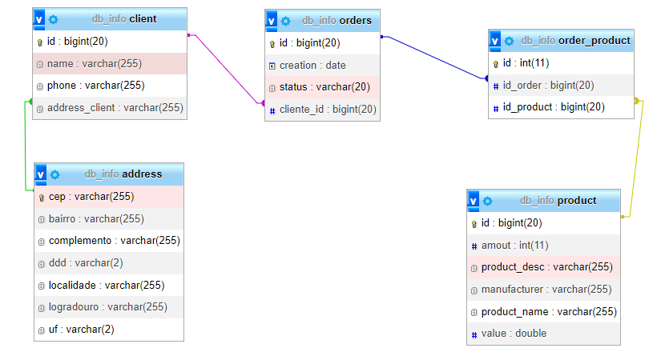
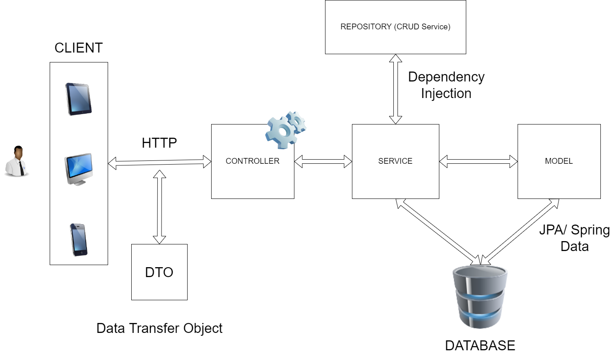

<h1>Spring Boot API Usage Guide for Computer Shop</h1>

<p>
<a alt="Java">
    
</a>
<a alt="Spring Boot">
        
</a>
<a alt="Gradle">
    
</a>
<p>

This document provides instructions on how to use the Spring Boot API to register customers, products, and orders in a computer store. The API was developed in Java and also makes requests to the external API https://viacep.com.br to register a customer with an existing Brazilian address. It is also worth noting that the MySQL database. Additionally, the API has documentation for the Swagger-ui interface, which can be used to test endpoints.

Example of a valid brazilian CEP(Zip Code) code request:
```
{
  "name": "Joao",
  "phone": "987654321",
  "addressRequest": {
    "cep": "01001001"
  },
  "id": 0
}
```
Response:
```
  {
    "name": "Joao",
    "phone": "987654321",
    "address": {
      "cep": "01001-001",
      "logradouro": "Praça da Sé",
      "complemento": "lado par",
      "bairro": "Sé",
      "localidade": "São Paulo",
      "uf": "SP",
      "ddd": "11"
    },
    "id": 1
  }
```
<hr>

## Configuration

Before you begin, make sure you have MySQL installed and configured correctly. Then, create a database in MySQL and update the `application.properties` file settings with the database access information, as shown in the example below:

```
#Database Config
spring.datasource.url=jdbc:mysql://localhost:3306/<DB_NAME>?createDatabaseIfNotExist=true
spring.datasource.username=<MYSQL_USERNAME>
spring.datasource.password=<MYSQL_PASSWORD>
```

Replace <DB_NAME>, <DB_USERNAME> and <DB_PASSWORD> with the correct information.

## Testing the endpoints

After running the application, go to 
```
http://localhost:8080/swagger-ui/index.html#/ 
```
and voilá! You will have access to Swagger with the fully documented api. From Schemas to the endpoints of each controller, Swagger does it without you having to use a web costumer.

## Database Modeling



### Relationships between entities

- Customer/ Address(One to Many)
- Order/ Product(Many to Many) 

To follow the relational model, _Many to Many_ relationships cannot exist. So the **OrderProduct** entity solves the problem

- Order/ OrderProduct(One to Many)
- Product/ OrderProduct(One to Many)

## Spring Boot Architecture


